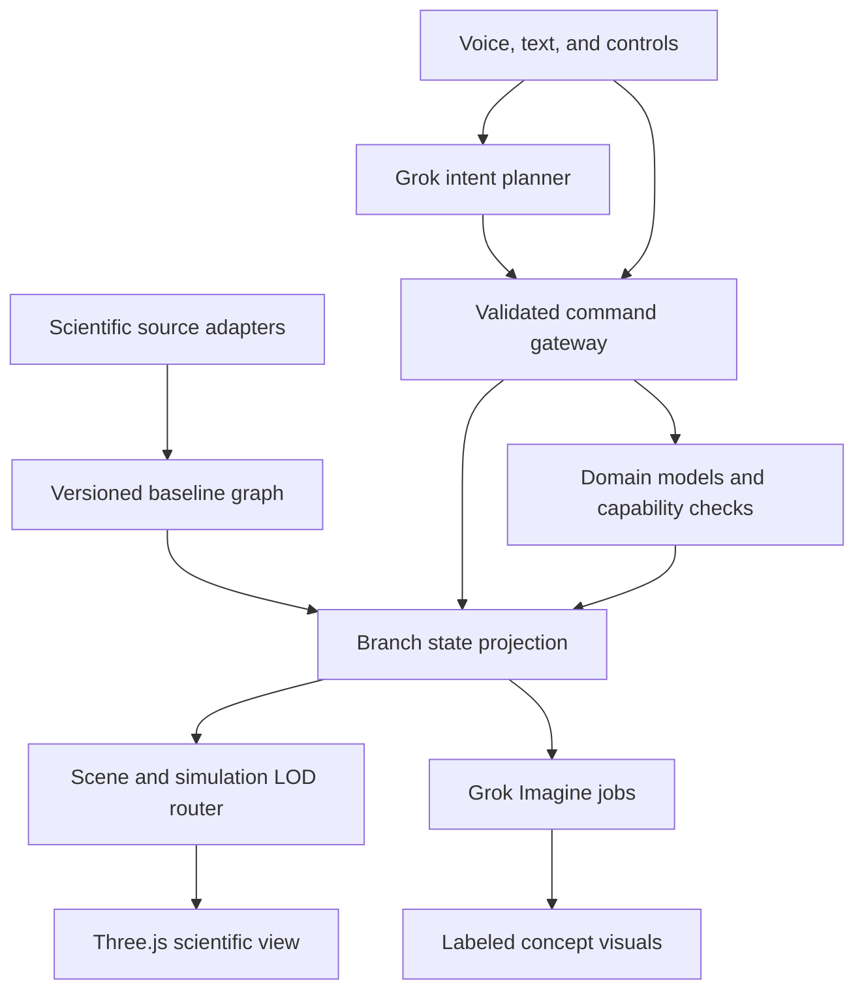

# COSMOS: Design document and Cursor build plan

Version 1.1 · October 3, 2026 · Implementation handoff

## 1. Product

COSMOS is an AI-guided, multiscale universe sandbox. Users explore a world grounded in scientific datasets, move from galaxies to particles through semantic zoom, and create branching counterfactual worlds using voice, text, and direct controls. Kardashev capabilities govern the scope of civilization engineering; Barrow capabilities govern manipulation at progressively smaller scales.

The central experience is: **explore reality → choose an intervention → calculate a modeled outcome → inspect and customize assumptions → visualize the changed world → undo or compare branches.**

Build a multiscale scientific game engine with specialized simulation modules, a shared world graph, and dynamic graphics/physics level of detail. This does not require CPU virtualization, KVM, a hypervisor, or a custom operating system.

### Hackathon requirements

The supplied challenge screenshot requires the project to be built with Cursor and to use the Grok Imagine or Voice API. Grok Bot for planning/team collaboration is described as a bonus. Preserve a short record of meaningful Cursor build iterations and actual API integration for the submission. A text-only Grok integration or a placeholder generated illustration does not satisfy the stated Imagine/Voice requirement.

### Design commitments

- Scientific datasets supply the baseline; deterministic models calculate supported interventions.
- Grok interprets intent, selects tools, explains outcomes, and proposes editable assumptions.
- Three.js supplies camera movement, interactive geometry, picking, particles, and scientific rendering.
- Grok Imagine supplies explicitly labeled speculative visuals and optional textures derived from the computed state.
- Every property has provenance. Observed, derived, assumed, simulated, and generated information remain distinguishable.
- Baselines are immutable, versioned snapshots. All interventions occur in branches.
- Load and simulate only the relevant domain and detail level. No universal full-fidelity physics solver.
- Unknown information may be filled with declared assumptions and customized; missing observations must never silently become measurements.

## 2. Required scope and judges’ demo

**The required hackathon demo includes Kardashev I, II and III, and Barrow B2, B4 and B6. All six levels are mandatory.** Build phases are implementation order, not permission to remove levels. Each level must have a navigable scene, sourced starting data, an executable intervention, editable assumptions, a visible state change, and an explanation of the modeled result. Merely displaying a level selector, a static illustration, or a property table does not complete that level.

The full scientific dataset spine below supports this scope. A source counts as integrated only when data is ingested, normalized, validated, and used in the product. Use bounded source subsets and simplified explicit models to make all six levels feasible; preserve the six-level scope while adjusting detail, sample sizes and effects.

### Required six-level experience

| Level | Scene and sourced baseline | Required interactive demonstration | Observable result |
|---|---|---|---|
| Kardashev I | Earth, selected Earthdata layers, planetary/orbital context | Configure a planetary energy infrastructure scenario; edit usable power and climate-control assumptions | Infrastructure changes on Earth, planetary power budget and achieved K update; declared planetary model shows its response |
| Kardashev II | Sun and Solar System from Horizons/SPICE | Build and customize a Dyson swarm: capture fraction, efficiency and orbital radius | Collectors appear, intercepted/useful power and achieved K update; Imagine visualizes the computed scenario |
| Kardashev III | Gaia stellar sample, galaxy context and catalog references | Expand a civilization across the galaxy; adjust travel speed, settlement delay and energy capture per settled system | Arrival front and settled systems change over scenario time; sample coverage and explicitly modeled galaxy-scale power update |
| Barrow B2 | Curated HBB sequence/variant/gene context from NCBI/Ensembl/ClinVar plus PDB reference | Apply a genetic repair counterfactual to a curated sequence target and compare before/after | Sequence and variant state change; curated gene-to-protein-to-cell mechanism visualization follows the declared educational rule |
| Barrow B4 | Selected atom/molecular context with NIST/PubChem/PDB records | Manipulate a selected atom’s electronic state using a defined atomic model | Electron-state visualization and calculated energy transition change, with units and source/model evidence |
| Barrow B6 | Fundamental-particle scene using PDG properties | Configure and execute a particle-level interaction in a bounded toy model | Incoming/outgoing particles, energy/momentum budget and interaction visualization update; unsupported physical predictions are identified |

These are concrete default scenarios for implementing the requested levels. The engine remains extensible to additional commands at each level. B3 molecular and B5 nuclear views connect the inward journey; they do not replace the required B2, B4 and B6 interventions.

### Connected demo journey

Begin at Earth and demonstrate K1, zoom outward to the Sun for K2, then the Milky Way for K3. Return to Earth and zoom through curated biological context for B2, into an atom for B4, then through nuclear context into the particle scene for B6. Demonstrate a branch comparison and reset after the six interventions. The same world graph, command gateway, provenance and semantic zoom unify every stop.

Grok understands commands and explains executed results. Grok Imagine adds state-linked speculative interpretations. Users can inspect sources and edit assumptions at all six levels. Real-world data stays preserved underneath the simulation branch.

### Additional scenarios

Mars terraforming, asteroid deflection, black-hole engineering and mission replay are additional scenarios. They must not displace any required level. The B2 genetic mechanism, B4 atomic manipulation and B6 particle interaction are required, not stretch goals. Educational counterfactual results remain labeled according to their actual model fidelity.

## 3. Technical stack

| Component | Decision | Purpose |
|---|---|---|
| Frontend | React, TypeScript, Vite | Fast local iteration and deployable browser client |
| 3D | Three.js, React Three Fiber, Drei | Interactive scenes and camera controls |
| Client state | Zustand | UI state and current branch projection |
| UI motion | CSS first; Motion optional | Panels and transition choreography |
| Runtime engine | Pure TypeScript package | Shared commands, branches, models, capability checks |
| Backend | FastAPI, Pydantic | Dataset adapters, secrets, AI gateway, jobs |
| Scientific preparation | Python, NumPy, Astropy, Astroquery, SpiceyPy | Offline ingestion and coordinate conversion |
| Persistence | SQLite initially; PostgreSQL upgrade | Branch events, manifests, conversations, generation jobs |
| Asset storage | Local development files; hosted object storage later | Scientific assets and generated media |
| Async work | Bounded backend job queue | Image generation and dataset requests |
| AI | Configurable Grok text, Imagine, **mandatory Voice** | Intent, visuals, speech (Voice executes tools) |
| Testing | Vitest, pytest, Playwright | Models, ingestion, critical demo path |

Choose WebGL initially. WebGPU, Redis, multiple agents, and separate MCP deployments are optional extensions. Pin working dependency versions in lockfiles. Verify current xAI model identifiers and SDK event schemas during setup rather than copying historical model names blindly.

## 4. Architecture



The planner cannot directly mutate arbitrary application state. It calls the same schema-validated command gateway used by UI controls. Model results become events; renderers consume projected state. Image generation consumes a branch revision and never writes scientific properties.

### Five runtime layers

1. **World graph:** typed entities, relationships, source identifiers, properties, assets, and available actions.
2. **Semantic zoom:** selects a meaningful entity/domain and converts between local coordinate spaces.
3. **Simulation modules:** deterministic, bounded domain models with declared validity and assumptions.
4. **Capability controller:** checks which interventions the selected Kardashev/Barrow configuration permits.
5. **Rendering and AI:** interactive scientific scenes plus explanations and speculative media.

## 5. World graph and provenance

Use a graph rather than treating all science as a single containment tree. A protein structure can be relevant to several tissues; genes encode products but do not spatially contain protein structures. The same star may have Gaia and exoplanet archive identifiers.

```ts
type EvidenceKind = 'observed' | 'derived' | 'assumed' | 'simulated';
interface Evidence {
  kind: EvidenceKind;
  sourceId?: string;
  sourceRecordId?: string;
  sourceUrl?: string;
  retrievedAt?: string;
  release?: string;
  method?: string;
  uncertainty?: { lower?: number; upper?: number; description: string };
  assumptions?: string[];
}
interface Property<T> {
  value: T | null;
  unit?: string;
  evidence: Evidence[];
  validAt?: { epoch: string; timeScale: 'UTC' | 'TDB' | 'TT' };
}
interface CosmosEntity {
  id: string;
  type: string;
  name: string;
  sourceIds: Record<string, string>;
  characteristicLengthM?: number;
  properties: Record<string, Property<unknown>>;
  assetRefs: string[];
  availableActions: string[];
}
interface Relationship {
  from: string;
  to: string;
  type: 'contains' | 'orbits' | 'encodes' | 'associatedWith' |
        'structureOf' | 'illustrates' | 'memberOf';
  evidence: Evidence[];
}
interface StateVector {
  positionM: [number, number, number];
  velocityMps: [number, number, number];
  originId: string;
  frame: string;
  epoch: string;
  timeScale: 'UTC' | 'TDB' | 'TT';
  aberrationCorrection: string;
}
```

Generated visuals have separate asset metadata: provider/model, prompt hash, input branch/revision, generation time, and `representation: concept`. They are never evidence for a physical property.

A baseline snapshot is a collection of independently dated observations/models, not a claim that all data was measured simultaneously in 2026. Record release, retrieval date, valid epoch, checksums, and transformations. Heliocentric astronomical states and protein-local coordinates use explicit distinct frames.

### Missing data and customization

Retain available source fields in raw archives; normalize fields the engine uses. For a required missing field, choose a declared default, a documented estimate, or a user-supplied value. Store the method and assumptions next to the value. Users can override assumptions inside their branch. An override invalidates dependent outputs and triggers recomputation.

Examples: unknown spacecraft attitude can use an editable velocity-aligned or Sun-pointing rule; unknown fuel uses an initial budget and explicit burn model; cabin temperature uses a simplified thermal model; crew dialogue is clearly fictional. Actual mission telemetry or transcripts take precedence when available. No agent infers measured fuel or cabin temperature from trajectory alone.

## 6. Scientific dataset registry

These links are official entry points and integration references. The runtime must verify endpoint availability, access terms, release, and chosen schema before marking an adapter ready. A portal/API catalog is not itself a downloaded dataset. Select explicit products/catalog tables and persist them in the manifest.

| Source | Access and official links | Initial subset and implementation notes | Stage |
|---|---|---|---|
| NASA/JPL Horizons | [API docs](https://ssd-api.jpl.nasa.gov/doc/horizons.html); `https://ssd.jpl.nasa.gov/api/horizons.api` | Sun, planets, Moon at a pinned epoch plus short trajectories; parse vector table inside response, retain origin/frame/time/units | MVP |
| NASA NAIF SPICE | [Data and kernels](https://naif.jpl.nasa.gov/naif/data.html); [generic kernels](https://naif.jpl.nasa.gov/pub/naif/generic_kernels/) | Leap seconds, selected ephemeris and body constants/orientation; SpiceyPy preparation. Spacecraft attitude requires relevant CK/frame/clock coverage | MVP geometry enrichment |
| ESA Gaia DR3 | [Programmatic access](https://www.cosmos.esa.int/web/gaia-users/archive/programmatic-access); TAP `https://gea.esac.esa.int/tap-server/tap` | Start with 10k quality-filtered stars, expand to 100k; preserve selection function, uncertainties and reference epoch | Outward slice |
| NASA Exoplanet Archive | [TAP guide](https://exoplanetarchive.ipac.caltech.edu/docs/TAP/usingTAP.html); `https://exoplanetarchive.ipac.caltech.edu/TAP/sync` | `pscomppars` for composite values; `ps` for references/default solutions. Seed TRAPPIST-1 and a few named systems; unknown inclinations/phases are assumptions | Outward slice |
| SDSS | [Data portal](https://www.sdss.org/); [SkyServer](https://skyserver.sdss.org/); [CASJobs](https://skyserver.sdss.org/casjobs/) | Pin a release and a spectroscopic galaxy subset; RA/Dec/redshift/class. Record cosmology when deriving distance. Release tools differ | Extended galaxy field |
| NASA HEASARC | [API hub](https://heasarc.gsfc.nasa.gov/docs/archive/apis.html) | Choose explicit compact-object/source catalogs via TAP or Astroquery. An X-ray source is not automatically an identified black hole | Optional astronomy |
| NASA PDS | [Search](https://pds.nasa.gov/datasearch/data-search/); [services](https://pds.nasa.gov/services/search/) | Selected Moon/Mars imagery and topography; pin product IDs. Convert scientific rasters to browser textures; record map projection and attribution | Planet assets |
| NASA Earthdata | [CMR API](https://cmr.earthdata.nasa.gov/search/site/docs/search/api.html); [Earthdata](https://www.earthdata.nasa.gov/) | Choose one temperature, vegetation or ice product initially. CMR discovers metadata; actual granules may require Earthdata Login and separate downloads | Earth layers |
| NOAA NCEI | [Web services](https://www.ncei.noaa.gov/cdo-web/webservices) | Selected climate time series; CDO requests require a token. Station weather and global climate are different products | Optional Earth |
| USGS | [Earthquake API](https://earthquake.usgs.gov/fdsnws/event/1/); `https://earthquake.usgs.gov/fdsnws/event/1/query` | Bounded date/region query as GeoJSON; earthquake points do not provide a complete tectonic/geological model | Optional Earth |
| Human Cell Atlas | [APIs](https://data.humancellatlas.org/apis) | Selected tissue/cell-type metadata and expression context; does not provide ready-made 3D anatomy or simulated cell behavior | Inward context |
| NCBI Datasets | [API reference](https://www.ncbi.nlm.nih.gov/datasets/docs/v2/api/); [REST guide](https://www.ncbi.nlm.nih.gov/datasets/docs/v2/api/rest-api/) | Curated HBB gene records, sequence and product accessions; assembly/version explicit | Inward slice |
| Ensembl | [REST API](https://rest.ensembl.org/) | Gene, transcript, sequence, variant lookups and cross-references; retain assembly and transcript IDs | Inward mapping |
| ClinVar | [Programmatic access](https://www.ncbi.nlm.nih.gov/clinvar/docs/maintenance_use/) | E-utilities or pinned exports for one curated variant; retain review status, accession, condition and conflicts | Educational mechanism |
| RCSB PDB | [API overview](https://www.rcsb.org/docs/programmatic-access/web-apis-overview); [4HHB](https://www.rcsb.org/structure/4HHB) | Start with hemoglobin 4HHB as a reference structure. Search/Data APIs plus mmCIF downloads; explicitly map chain/residue numbering before variant claims | Inward MVP |
| PubChem | [PUG-REST](https://pubchem.ncbi.nlm.nih.gov/docs/pug-rest); `https://pubchem.ncbi.nlm.nih.gov/rest/pug/` | Selected compound properties and available 3D SDF conformers. A conformer is a model, not an observed molecule's motion | Molecular extension |
| NIST ASD | [Atomic Spectra Database](https://www.nist.gov/pml/atomic-spectra-database) | Cache evaluated levels/lines/ionization energies for H, C, N, O and Fe. These tables do not supply complete electron wavefunctions | Atomic slice |
| NNDC NuDat / ENSDF | [NuDat](https://www.nndc.bnl.gov/nudat3/); [ENSDF](https://www.nndc.bnl.gov/ensdf/) | Selected isotope level/decay properties. Use available official exports; confirm formats. Add a separately sourced mass table if binding energy is needed | Nuclear slice |
| Particle Data Group | [PDG](https://pdg.lbl.gov/); [verified API entry](https://pdg.lbl.gov/2025/api/index.html) | Pin the accessible API/database edition, Python package and SQLite snapshot; selected particle properties. Resolve latest edition rather than assuming a 2026 endpoint | Particle slice |

The core roadmap includes Horizons, SPICE, Gaia, Exoplanet Archive, SDSS, PDS, Earthdata, HCA, NCBI/Ensembl, ClinVar, PDB, PubChem, NIST, NNDC and PDG. HEASARC, NOAA and USGS are valuable additions. Anatomy requires separately licensed curated models or procedural illustrative assets; the sources above do not supply a complete human mesh.

### Seed queries and fetch recipes

Horizons parameters for heliocentric geometric Mars vectors: `COMMAND='499'`, `CENTER='500@10'`, `EPHEM_TYPE='VECTORS'`, `REF_SYSTEM='ICRF'`, `REF_PLANE='FRAME'`, `VEC_CORR='NONE'`, `OUT_UNITS='KM-S'`, `CSV_FORMAT='YES'`, and explicit start/stop/step. URL-encode parameters using an HTTP client. Parse rows between `$$SOE` and `$$EOE`; JSON output still contains a text result field. Convert km to m once. Preserve the reported time scale.

Gaia seed ADQL:

```sql
SELECT TOP 10000 source_id, ra, dec, parallax, parallax_error,
  pmra, pmdec, radial_velocity, phot_g_mean_mag, bp_rp, ref_epoch
FROM gaiadr3.gaia_source
WHERE parallax > 0 AND parallax_over_error > 10 AND ruwe < 1.4
ORDER BY phot_g_mean_mag ASC
```

This is a bright, high-quality subset, not an unbiased map of the whole galaxy. For high signal-to-noise positive parallaxes, an approximate distance in parsecs is `1000 / parallax_mas`; use published probabilistic distance catalogs for broader samples. Preserve uncertainties. Never invert negative or noisy parallaxes indiscriminately. RA/Dec/distance become Cartesian coordinates in an explicit frame; a Gaia star field needs a separate, labeled galaxy morphology background.

Exoplanet seed ADQL:

```sql
SELECT pl_name, hostname, ra, dec, sy_dist, pl_orbper,
  pl_orbsmax, pl_rade, pl_bmasse, st_mass, st_rad, st_teff
FROM pscomppars
WHERE hostname = 'TRAPPIST-1'
```

Inspect current table columns first. Keep nulls. Match host stars via documented identifiers/cross-matches; name strings alone are insufficient for catalog joins.

RCSB reference asset: `https://files.rcsb.org/download/4HHB.cif`. Parse atomic coordinates, alternate locations, occupancy, elements, chains and residues; convert Å to m only in scientific storage, and use Å-sized local scene units for rendering. Wild-type reference hemoglobin is not automatically a mutant structural model.

PubChem example: `https://pubchem.ncbi.nlm.nih.gov/rest/pug/compound/name/caffeine/property/MolecularFormula,MolecularWeight/JSON`. Request 3D SDF separately where available. Keep compound CID and conformer provenance.

### Ingestion and cache contract

Each adapter implements `discover`, `fetch`, `normalize`, `validate`, and `manifest`. Write raw data before transformation. Each manifest contains source URLs, release, query, retrieval time, checksum, license/attribution, coverage, units, frame, transformation version, and validation status.

Cache keys include source + release + canonical parameters + normalizer version. Snapshots are immutable. Use async Gaia TAP jobs for larger extracts. Apply source-specific throttling, timeouts and bounded retries with backoff; honor upstream limits. Keep NCBI/NOAA/Earthdata tokens on the backend. Avoid browser-to-science-API requests and CORS dependencies.

Ship a small, genuine source-derived demo cache after initial ingestion. A fixture invented for development must be labeled synthetic and cannot be counted as real-data integration. Offline mode reports snapshot age and coverage. Live refresh creates a new snapshot, not a silent mutation of the baseline.

## 7. Semantic zoom and numerical precision

The camera has a physical context and `log10(viewSpanMeters)`. Typical anchors are galaxy ~10^21 m, Solar System ~10^13 m, planet ~10^7 m, human ~1 m, cell ~10^-6 m, molecule ~10^-9 m, atom ~10^-10 m, nucleus ~10^-15 m. These are navigation anchors, not universal boundaries.

Route by selected entity, target domain, and view scale together. Scale alone cannot distinguish a bacterium from an unrelated microscopic object. A curated zoom route describes semantic links and transition anchors. Missing detail shows an explanatory placeholder rather than an invented observation.

Maintain double-precision physical values outside GPU geometry. Each scene chooses a local origin and meters-per-scene-unit. Rebase camera and visible positions into that frame. Never put galaxy coordinates and atomic coordinates in one float32 scene. Keep scientific distance separate from exaggerated visual radius and annotate size exaggeration.

Transition sequence: resolve target → preload assets → retain outgoing scene → match the target's screen anchor → animate camera/scale → crossfade → release unused GPU assets. Cancel stale loads by transition ID. Apply hysteresis around scene thresholds to prevent flicker; respect reduced motion. Empty areas do not automatically contain a human or molecule.

### Physics LOD

- Galaxy: static catalog plus an analytic expansion frontier; no per-star N-body solve.
- Solar System baseline: interpolate cached ephemerides within documented coverage.
- Intervention trajectory: run a separately labeled numerical model from the branch's initial state.
- Earth: selected map layers and aggregate energy/atmosphere parameters.
- Cell/protein: illustrative biological context and real structural coordinates; no atomistic whole-cell simulation.
- Atomic/nuclear: educational property visualizations and selected toy models; no claim of a universal quantum solver.

Hidden modules pause computation or evaluate state lazily at the current branch time. Persist model time and seed; never reset hidden scenes arbitrarily. UI animation time and scientific scenario time are distinct.

## 8. Capability controls

Provide two independent controls: Kardashev energy access and Barrow manipulation depth. Neither is the camera zoom. Observing any loaded object is allowed; interventions require implemented capability support.

Use a continuous energy metric `K = (log10(P_W) - 6) / 10` for positive usable power, labeled as the chosen Sagan-style convention. Conventional reference levels are K1 ~10^16 W, K2 ~10^26 W and K3 ~10^36 W. A slider selects a scenario's capabilities/budget; computed available power determines achieved K. Merely setting the slider must not assert that humanity actually possesses that infrastructure.

Use explicit application Barrow capability labels: B1 macroscopic, B2 genetic, B3 molecular, B4 atomic, B5 nuclear, B6 particle. Show names because numbering conventions and speculative interpretations vary. Genetic repair is not intrinsically a B4 operation; classify the actual modeled intervention.

Define actions with target types, capability requirements, parameter bounds, implementation status and model ID. Unsupported actions return a helpful explanation and available alternatives. Higher tiers expose configured speculative rules rather than automatically permitting impossible outcomes under ordinary physics.

## 9. Domain models

### Kardashev I: planetary energy infrastructure

Inputs: sourced Earth context, baseline usable power P0, added infrastructure capacity C, utilization u in [0,1], and distribution efficiency η in [0,1]. Source P0 from a selected energy record if available; otherwise expose it explicitly as an editable assumed scenario value. Calculate `P_useful = P0 + C × u × η`; derive achieved K using section 8. Render energy nodes/grids on Earth and show capacity, losses and useful power. Allow climate-control coupling through the separately declared planetary energy-balance model. Do not automatically infer climate improvement from a higher K value. This intervention is mandatory for K1.

### Kardashev II: Dyson swarm

Inputs: star luminosity L in W, capture fraction f in [0,1], conversion efficiency η in [0,1], radius r in m. Outputs:

- Intercepted power `P_intercepted = f × L`.
- Useful power `P_useful = η × f × L`.
- Ideal effective collector area `A_effective = f × 4πr²` under a simple isotropic projected-area approximation.

Explain that geometric overlap, shadows, orbital stability, heat rejection, material availability and construction time are omitted initially. Render a deterministic sample of collectors in orbital bands; visual particle count is separate from modeled collector count/area. A ring or swarm is the initial implementation, not a mechanically stable solid shell.

### Kardashev III: expansion and energy accounting

Precompute a bounded neighbor graph over sampled star positions. Arrival time on an edge is distance / travel speed + settlement delay. Compute earliest arrival with a shortest-path algorithm, seeded at a chosen system. Bound ordinary travel speed to at most c; faster-than-light mode is separately marked speculative. Report results as coverage of the selected sample, not a measured count of all Milky Way stars.

K3 additionally needs energy accounting: for each settled sample system, calculate usable stellar power from sourced luminosity where available or an explicitly assumed stellar model, capture fraction and efficiency. Sum sample power directly. Galaxy-wide estimates require declared population weights and luminosity assumptions; label these extrapolations. Keep achieved K separate from selecting Type III capability. The selected capability permits the scenario; outputs report what the scenario has achieved.

### Planetary energy balance

Baseline first approximation: `T_eq = [S(1-a)/(4εσ)]^(1/4)`. Parameters include albedo, emissivity, stellar flux and a separately declared greenhouse offset. This is an equilibrium estimate, not local weather or a validated terraforming prediction. Ocean/vegetation controls are explicit scenario assumptions unless a model actually derives them. Grok Imagine may interpret these parameters visually but does not calculate temperature.

### Orbital intervention

Start from sourced state vectors; apply an explicit delta-v and integrate a declared two-body or restricted model with fixed/adaptive timesteps. Report horizon, integrator tolerance and gravitational assumptions. Validate against a short reference trajectory before offering comparisons. Closest approach is available; collision probability is unavailable until input covariance, sampling and uncertainty propagation are implemented.

### Biological mechanism

Curate a disease → variant → gene → protein chain with explicit accessions, transcript and residue mapping. Render the reference structure; highlight the implicated residue only after alignment validation. A mutation edit changes an educational branch state. Downstream cell effects use a clearly declared qualitative rule or bounded toy parameter, not an invented clinical probability. A changed residue does not automatically predict folding or cure disease.

### Barrow B2: genetic counterfactual

Implement a curated sequence-edit operation with transcript/accession, reference bases, target position and alternate bases. Validate the reference sequence and coordinate convention before applying. Store before/after sequence, variant state and a curated downstream mechanism rule. Animate the documented gene/protein/cell relationships and display the assumption behind any downstream response. The demo must execute the edit and show the changed branch, not only highlight a variant. This is a required educational counterfactual, not a prediction of treatment efficacy.

### Barrow B4: atomic electronic-state manipulation

Implement a selected atom/ion with sourced initial/final energy levels and an illustrative electron-state renderer. A simple hydrogenic scene may use an explicit analytic orbital model; more complex atoms use available evaluated level records and clearly illustrative clouds. Inputs select the permitted initial/final level. Calculate `ΔE = E_final - E_initial`; for a radiative transition calculate photon frequency from `|ΔE| / h` with unit conversion, and wavelength from c/frequency. Transition selection rules and unavailable transition probabilities must be represented honestly. Update the level occupancy, cloud visualization and branch energy ledger. This is an executable B4 intervention, not an atomic properties table.

### Barrow B6: particle interaction sandbox

Use a bounded educational electron–positron annihilation scenario in the center-of-momentum frame. Source electron mass/charge from PDG and use explicit relativistic kinematics. Inputs include each incoming particle’s kinetic energy T and collision axis; opposing equal-energy momenta permit a two-photon toy outcome. Compute total energy `E_total = 2 × (m_e c² + T)` and each photon energy `E_gamma = E_total / 2`; emit opposing photons so total momentum and charge balance. Show incoming particles, interaction event and outgoing photons plus a conservation ledger. This is a deterministic kinematic toy model; it does not calculate cross-sections, collision probability or full quantum dynamics. Changing T changes the output energy and animation. Validate supported initial states rather than accepting arbitrary particle combinations. B6 must execute this state transition interactively.

### Atomic, nuclear, particle views

Use sourced properties and labeled conceptual visualizations. Electron clouds require a declared orbital model; NIST energy tables alone do not reconstruct a many-electron wavefunction. Nuclear levels and decay chains use documented isotope records; particle properties use PDG. Do not depict quarks as individually manipulable classical marbles while claiming validated physics.

## 10. Branches, commands, and reproducibility

```ts
interface Branch {
  id: string;
  baselineId: string;
  parentBranchId?: string;
  forkRevision?: number;
  revision: number;
  scenarioTimeSeconds: number;
  seed: number;
}
interface Command {
  commandId: string;
  branchId: string;
  expectedRevision: number;
  action: string;
  targetId: string;
  parameters: Record<string, unknown>;
}
interface ModelResult {
  modelId: string;
  modelVersion: string;
  inputs: Record<string, unknown>;
  outputs: Record<string, Property<unknown>>;
  assumptions: string[];
  warnings: string[];
}
```

Store baseline + ordered events + occasional checkpoints. Validate command schema, target, capability, parameter ranges, revision and model support before appending an event. Duplicate command IDs are idempotent. Persist events and revision atomically. A stale revision returns a conflict and latest revision, not a last-write-wins overwrite.

Undo changes the branch event cursor or applies a recorded inverse. A new action after undo truncates the redo path or creates a child branch explicitly. Reset returns to baseline projection; preserve saved branches. Replaying the same seed, model versions and events yields identical numerical results. Generated imagery is cached separately and is not deterministic simulation state.

Generation jobs capture baseline, branch ID, revision and parameter hash. A result from an old revision belongs in history and must not replace the current state's visual. Store generated bytes in durable asset storage rather than relying on expiring provider URLs.

## 11. Grok and MCP integration

Begin with one orchestrator and ordinary tool functions. Multiple specialist agents are unnecessary for the first demo. Add separate astronomy, biology or visualization roles only when workflows justify them. MCP is an optional wrapper around existing typed tools, not a second world-state implementation.

Tools:

| Tool | Input | Output/behavior |
|---|---|---|
| `search_entities` | query, domain | IDs and sourced summaries |
| `get_entity` | entity ID, branch ID | Properties and provenance |
| `get_context` | branch ID | Focus, capabilities, revision, available models |
| `navigate_to` | entity ID, route | Client navigation intent |
| `preview_action` | command parameters | Validated estimate and assumptions |
| `apply_action` | Command | Committed event, revision and result |
| `set_capabilities` | branch, settings | Validated capability event |
| `compare_branches` | two branch IDs | Property/model differences |
| `undo`, `redo`, `reset` | branch, expected revision | State revision |
| `generate_concept` | branch revision, target, visual style | Async job ID |
| `get_job` | job ID | Status, asset or error |

Planner instruction: inspect current context; resolve targets; use implemented tools; state assumptions; never fabricate a tool result or scientific observation. Ask for clarification only when the target or materially important parameters are ambiguous. Defaults for reversible sandbox actions may be applied and exposed for editing. Limit tool loops, execution time and per-request generation count.

### Imagine

Implement a server-side xAI adapter. Official integration reference: [image generation tool](https://docs.x.ai/developers/tools/image-generation), with direct generation/editing linked there. Use current supported models through configuration. For the first demo, a direct generation call from a structured simulation result is easier to control; agent-driven generation may follow.

Prompt inputs: object and baseline asset, model parameters/outputs, visual style, camera view, and explicit “speculative concept visualization.” Scientific numbers remain HTML/UI text, not text drawn by the image model. Present concept images in a side panel initially. Arbitrary images are not automatically seamless equirectangular planet textures; require projection checks and seam QA before wrapping a sphere.

Generate/edit after a stable state, cache by model + prompt + parameters + source asset, bound costs, and handle timeout/retry/cancel. If integration fails, show the error and retain Three.js output. Cached prior API-generated visuals may support demo reliability, but document that they are cached; at least one actual successful integration must be evidenced.

### Voice (mandatory — supersedes earlier optional wording)

Official reference: [speech-to-speech](https://docs.x.ai/developers/model-capabilities/audio/speech-to-speech). Voice is **required** across Kardashev I–III and Barrow B2/B4/B6. Users must speak requests to create/modify scenarios, navigate levels, adjust assumptions, compare results, and undo. Voice must **execute simulation tools and change world state**, not only narrate.

Implementation: microphone permission, push-to-talk and optional server VAD, visible transcript, and text fallback that uses the same tools. Keep permanent API keys server-side; browsers authenticate with ephemeral tokens via WebSocket subprotocol `xai-client-secret.${token}` from `POST /api/voice/session`. Model: `grok-voice-latest`. Custom `function` tools map to the command gateway (`apply_action`, `navigate_to`, `set_capabilities`, `undo`/`redo`/`reset`, `get_context`, …). Narrate actual tool results after execution. Barge-in cancels narration; it does not silently undo committed actions. Offline demo path: Web Speech + local intent parser still mutates branch state when the API key is unavailable.

## 12. UI

Full-screen dark scientific canvas, readable labels, restrained accent colors. Central scene; left exploration/search and breadcrumbs; right inspector with source/assumption/model tabs; bottom physical scale ruler, timeline and voice/text controls; top branch selector, compare, undo and reset. Capability controls remain separate from zoom.

The inspector shows units, uncertainty, epoch, source links and editable assumptions. A compact scene legend identifies real catalog geometry, illustrative context and generated concept assets. Atoms and planets may be enlarged for visibility, with an explicit size mode toggle. Keyboard navigation and reduced motion must work; text controls offer the same actions as speech.

Show job states: queued, running, complete, failed, canceled. Show data states: cached, refreshing, missing, outside coverage. A user can continue navigating during AI/image work. Avoid fabricated progress percentages.

## 13. Backend and repository contracts

Suggested layout:

```text
cosmos/
  apps/web/src/{components,scenes,navigation,state,api}/
  packages/engine/src/{graph,commands,branches,capabilities,models}/
  packages/contracts/                 # JSON schemas and generated TS types
  backend/app/{api,adapters,ai,jobs,persistence}/
  scripts/ingest/                     # reproducible source preparation
  data/{raw,normalized,manifests}/
  assets/{scientific,illustrative,generated}/
  tests/{engine,adapters,e2e}/
  docs/{DESIGN.md,BUILD_STATUS.md,DEMO.md}
  .env.example
```

Generate frontend types from shared JSON Schema/Pydantic contracts; avoid manually divergent definitions. The TypeScript engine is the authoritative simulation implementation initially. Backend AI plans return proposed commands; the client engine validates and calculates, then persistence checks schema/revision. Before adding multi-user collaboration, move authoritative command execution to a server-side engine service so clients cannot write trusted results arbitrarily. Single-user hackathon scope should be stated explicitly.

API contract:

- `GET /api/health` reports readiness without secrets.
- `GET /api/baselines`, `/api/baselines/{id}/manifest`.
- `GET /api/entities?query=&domain=`, `/api/entities/{id}`.
- `POST /api/branches`, `GET /api/branches/{id}`.
- `POST /api/branches/{id}/events` with command ID and expected revision; atomic event persistence.
- `POST /api/chat` for streamed planner text and proposed tools.
- `POST /api/concepts`, `GET /api/jobs/{id}`, `POST /api/jobs/{id}/cancel`.
- Optional `POST /api/voice/session` using current provider credential flow.

Use one event-stream protocol with request ID, branch ID, revision and event type. Scientific assets are fetched by manifest reference, not embedded in every state message. Validate external URLs and downloaded asset sizes; use an adapter allowlist. Configure development origins and deployment CORS explicitly.

Environment template: `XAI_API_KEY`, `XAI_TEXT_MODEL`, `XAI_IMAGE_MODEL`, `DATABASE_URL`, `DATA_DIR`, `ASSET_DIR`, optional `NASA_EARTHDATA_TOKEN`, `NOAA_TOKEN`, `NCBI_API_KEY`. No real values in source control, prompts or frontend bundles.

## 14. Performance and reliability targets

Treat these as targets to measure on the demo laptop: 30+ FPS baseline, ~50 FPS desirable; 10k Gaia points initially; 100k on higher quality settings; 2k–5k instanced swarm elements; a protein scene capped by structure size and rendering mode. Initial compressed demo data target under 20 MB, with optional assets lazy-loaded. Support a lower DPR and reduced effects.

Use GPU instancing/point buffers, workers for CPU-heavy preparation, cancellation, and explicit texture/material/geometry disposal. Avoid React state updates per particle per frame. Numeric control changes should update within 100 ms for the simple models. API/image latency is external and displayed asynchronously. Every core science demo should survive a network outage after loading its cache.

## 15. Cursor build path: deliver all six levels

Build the complete requested scope. Track K1, K2, K3, B2, B4 and B6 independently in BUILD_STATUS.md as pending, implemented or verified. No phase is a substitute for another. Do not declare the judges’ demo ready until all six are verified.

The deadline and team capacity have not been supplied, so these are ordered work packages rather than a promise that the complete build fits an assumed time window. Keep a runnable application at each checkpoint.

| Phase | Deliverable and exit criterion |
|---|---|
| 0. Shared foundation | React canvas, FastAPI, contracts, local-coordinate scenes, world graph, immutable baseline, branches, commands, capability controls and real Imagine smoke test |
| 1. Six-level data pack | Curated baseline data for Earth, Sun/Solar System, Gaia/galaxy context, HBB variant/sequence/protein, selected atoms/isotopes and PDG particles; manifests and provenance for every level |
| 2. Kardashev I | Interactive Earth infrastructure/power-budget scenario, selected Earth layer, editable planetary assumptions and visible modeled response |
| 3. Kardashev II | Deterministic Dyson model and instanced swarm, editable controls, power/K outputs, undo/reset and state-linked Imagine concept |
| 4. Kardashev III | Navigable galaxy scene, seeded sampled expansion, time/speed/settlement controls, coverage and modeled energy accounting |
| 5. Barrow B2 | Curated genetic intervention, verified sequence/variant mapping, before/after comparison and gene/protein/cell mechanism animation |
| 6. Barrow B4 | Atomic-state intervention, sourced energy levels, editable permitted state/energy controls and updated electron visualization |
| 7. Barrow B6 | Particle interaction sandbox, sourced particle properties, conservation checks and animated before/after outcome |
| 8. Unified AI and traversal | Grok tools execute interventions at all six levels; semantic transitions, provenance, customization, Imagine jobs and branch comparison work throughout |
| 9. Demo verification | Six-level end-to-end checks, cache reliability, performance tuning, recorded backup and a rehearsed judges’ script; Voice integration according to intended interaction plan |

If schedule pressure arises, reduce catalog sample counts, geometry density, visual effects and the number of additional scenarios. Use a smaller documented model at each required level. Do not silently drop a level, turn it into a static slide, or mark it optional. Report a blocker and its proposed resolution explicitly; any change to the six-level scope requires the user’s decision.

### Cursor prompt 1: initialize the full scope

> Read this design document. The judges’ demo requires Kardashev I, II, III and Barrow B2, B4, B6. Preserve all six as mandatory. Create docs/BUILD_STATUS.md with a separate status and acceptance checklist for each level. Implement phase 0: React/TypeScript/Vite, Three.js scenes, FastAPI health endpoint, shared contract skeleton, world graph, branches/commands, env template and startup instructions. Verify current xAI Imagine documentation and make a backend-only API smoke-test script. Report actual results and blockers; do not claim success without credentials.

### Cursor prompt 2: build the six-level data pack

> Implement phase 1 for all six required levels. Ingest bounded, genuine source data for Earth, Horizons/SPICE Solar System, Gaia/galaxy context, curated HBB sequence/variant and PDB structure, NIST atomic states, NNDC connecting nuclear context and PDG particle properties. Retain raw data, explicit IDs and manifests. Validate units, frames, epochs and biological mappings. Build local cache mode and dataset readiness status. Keep missing data visible and declared assumptions editable.

### Cursor prompt 3: implement Kardashev I, II and III

> Implement phases 2–4. K1 needs a planetary energy infrastructure intervention and visible Earth response. K2 needs the customizable Dyson swarm and energy calculation. K3 needs galaxy-scale expansion over a sourced sample, scenario time controls and explicit energy accounting. All three must run through the command gateway, change branch state, update visible geometry and expose numerical outputs/assumptions. Test bounds, replay, baseline immutability, stale revisions and model invariants. Do not stop after K2 or mark K3 optional.

### Cursor prompt 4: implement Barrow B2, B4 and B6

> Implement phases 5–7. B2 must execute a curated genetic counterfactual and display sequence plus mechanism changes. B4 must execute an atomic electronic-state intervention with sourced energy levels and a visible state transition. B6 must execute a particle interaction with sourced properties, explicit toy-model assumptions and energy/momentum checks. Add molecular and nuclear context for semantic traversal. These must be interactive interventions, not browsing-only scenes. Keep modeled educational outcomes distinct from experimental or clinical claims.

### Cursor prompt 5: connect the whole experience

> Implement phase 8. Connect Grok planning/tools to all six required level interventions through the same validated gateway. Add semantic navigation Earth → Sun → galaxy → Earth/biology → atom → particles with preloading, local coordinates and cancellation. Connect Imagine generation to committed state with revision checks, labels and cached asset bytes. Users must inspect sources, tweak assumptions, undo and compare branches across the full journey. Handle failed tools and provider errors truthfully.

### Cursor prompt 6: verify and present all six levels

> Implement phase 9. Run the six-level acceptance matrix and a complete judges’ rehearsal. Fix blockers for K1, K2, K3, B2, B4 and B6 before declaring completion. Measure frame rate, verify offline data, deterministic models, stale image jobs and reset behavior. Write docs/DEMO.md showing every level, actual data integrations, model assumptions and genuine xAI API evidence. Include startup/deployment instructions and a recorded backup. Do not shorten the demo by omitting a required level.

## 16. Acceptance checks

Required before claiming the six-level judges’ demo complete:

1. A real Horizons response drives visible positions; raw source and normalized values are traceable.
2. Camera and physical coordinate scaling work without precision jitter in supported scenes.
3. Swarm output obeys input bounds and the documented formula; UI controls recompute it.
4. Reset and undo restore prior state; baseline hash does not change.
5. Commands reject invalid capability, unsupported target, invalid ranges and stale revisions.
6. Duplicate command IDs do not execute an intervention twice.
7. Grok uses actual tool results; failed tools are explained truthfully.
8. At least one actual Grok Imagine or Voice API call is integrated and evidenced.
9. Generated concepts are labeled and linked to the correct branch revision; stale jobs cannot overwrite current visuals.
10. Cached data permits the primary exploration/simulation loop without network access.
11. Required protein coordinates originate in a real structure and retain chain/residue identifiers.
12. A tester can complete the rehearsed six-level demo with text/buttons if microphone or live generation fails.
13. K1 executes an Earth infrastructure intervention with a visible planetary result and energy budget.
14. K2 executes a Dyson swarm intervention with geometry, power and capability outputs.
15. K3 executes galaxy expansion with changing arrivals, coverage and explicitly modeled energy.
16. B2 executes a genetic counterfactual with sequence and mechanism changes.
17. B4 executes an atomic electronic-state intervention with energy and visualization changes.
18. B6 executes a particle interaction with visible outcome and conservation checks.
19. Each of all six levels has editable controls, source/model evidence, branch-state persistence and undo/reset coverage.
20. The full connected navigation route and all six interventions pass an end-to-end rehearsal. A missing level fails demo completion.

Adapter tests should use stored genuine responses to test parsing, missing values and error messages without repeatedly hitting upstream APIs. Test scientific invariants and workflow failures, not merely mirrored implementation details. Every model presents its assumptions and units.

## 17. Judges’ presentation: all six levels

The presentation must show all six requested levels. Confirm the actual presentation time limit; the five-minute allocation below is an adjustable rehearsal plan, not an imposed limit. If less time is available, shorten each stop while retaining all six.

| Time | Required demonstration |
|---|---|
| 0:00–0:20 | Introduce COSMOS, real-data baseline, independent Kardashev and Barrow capabilities |
| 0:20–1:00 | K1: manipulate Earth energy infrastructure, show calculated power and planetary response |
| 1:00–1:40 | K2: build/tweak the Dyson swarm, show energy calculation and state-linked Imagine concept |
| 1:40–2:20 | K3: zoom to the galaxy, advance expansion time and change speed/settlement assumptions |
| 2:20–3:00 | B2: zoom into biological context, apply a genetic counterfactual and compare sequence/mechanism states |
| 3:00–3:40 | B4: zoom into an atom, change its electronic state and show the calculated energy transition |
| 3:40–4:20 | B6: enter particle context, execute an interaction and show conservation plus the animated result |
| 4:20–5:00 | Compare branches, inspect provenance/assumptions and reset to reality |

Preload each required scene and prepare a keyboard-driven route, cached scientific snapshots, genuinely API-generated concepts and a recorded complete six-level backup. Include real API usage evidence. A backup supports reliability; it does not substitute for implementing the six interactive level experiences.

## 18. Source verification and open decisions

During this handoff, official Horizons, SPICE data, RCSB API overview, HCA API overview, xAI image-generation-tool and speech-to-speech pages were opened. The accessible PDG 2025 API page was verified; a 2026 API URL is deliberately not assumed. Other registry entries are official access references retained from planning and require integration-time schema/product verification. No bulk datasets, API credentials, application implementation or runtime integration were produced by this document-writing task.

Gaia distance handling follows the caution in [Gaia parallaxes guidance](https://arxiv.org/abs/1804.09376) and the [EDR3 probabilistic distance catalog paper](https://arxiv.org/abs/2012.05220). These justify preserving uncertainties and avoiding indiscriminate inverse-parallax distances.

Decisions Cursor can make without blocking: supported dependency versions, available xAI model IDs, local snapshot epoch, scene quality defaults and initial asset formats. Record decisions in BUILD_STATUS.md. Decisions needing actual project information: hackathon deadline, team capacity, API budget and deployment target. Start phases 0–3 while these are resolved.

The required completed hackathon product demonstrates Kardashev I, II, III and Barrow B2, B4, B6 together, with real-data baselines, explicit executable models, customization, semantic zoom, branching and genuine Grok Imagine/Voice integration. Intermediate checkpoints establish build order only; they do not redefine the user’s demo scope.

---

## 19. As-built notes (implementation snapshot)

This section records what the repository actually ships. Prefer this over aspirational phase language when judging completeness.

### Delivered

- Monorepo: `apps/web`, `packages/engine`, `backend`, `data/`, `scripts/ingest`, `docs/`
- Deterministic engine with K1/K2/K3/B2/B4/B6 models, branches, undo/redo/reset, capability gates, Vitest coverage
- React Three Fiber scenes for all six levels + molecular/nuclear context
- FastAPI health, baselines/entities, branches/events, chat tools, concepts/jobs, voice session
- SpacetimeDB science tables (not a blob): `star`, `solar_body`, `earth_*`, `exoplanet`, `particle`, `atomic_level`, `isotope`, `gene`, `source_manifest`
- Catalog pack: named Hipparcos/Gaia stars + labeled assumed nearby-disk and field stars (~4k), Horizons planets plus moons/dwarfs, ~80 named exoplanets, PDG particle set, NIST/Rydberg levels, selected isotopes, curated genes (HBB + additional loci), global city anchors
- K2 Dyson: `P = f × L☉` with civilization-scale capture (default ~22% of L☉), up to 8k instanced collectors, translucent swarm shell, orbital bands
- K3: kNN+Dijkstra over the full sample; settled stars, arrival tree, expansion front in ly; Voice/timeline execute the same command
- Voice mandatory UI with Grok realtime path + offline intent parser that mutates world state
- Imagine concept panel wired to `/api/concepts` (requires `XAI_API_KEY`)
- Inspector Sources / Assumptions / Model / Compare tabs; branch undo/redo/reset/diff

### Deviations / simplifications

- Single-user: client engine is authoritative; backend persists events and serves AI/data
- No SpiceyPy runtime; Horizons vectors baked/cached for demo epoch
- Live Gaia TAP still times out; extra stars are explicitly `evidenceKind: assumed` disk/field samples, not a silent Gaia substitute
- Anatomy/HCA not fully wired; B2 uses curated HBB + 4HHB plus additional gene rows
- Compare uses an alternate branch id; full fork-from-revision UX is minimal
- Live xAI Imagine/Voice smoke tests require a local API key (not committed)
- Visual radii are exaggerated; physical values stay SI. K2/K3 power uses the documented Sagan K formula

### Run

See root `README.md` and `docs/DEMO.md`.
